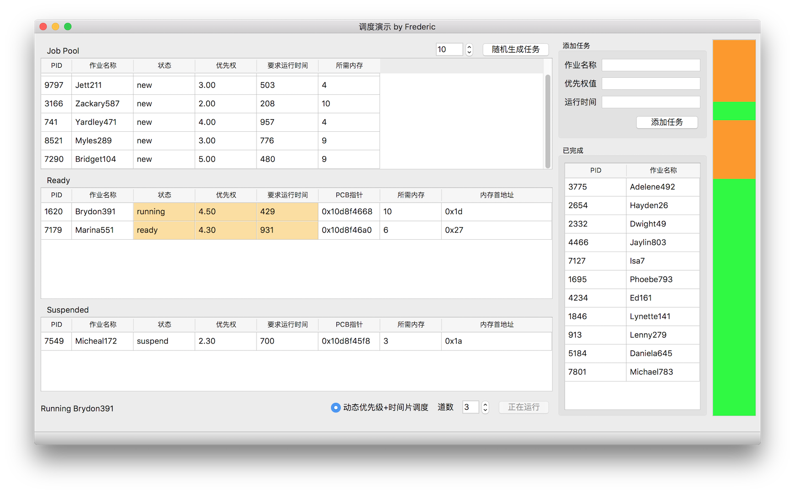

## Simulate-CPU-Scheduling

A simulation programme to demonstrate CPU scheduling written in Python with PyQt. Experiment of Operating System course.

### Environment
Python 3.6 + PyQt 5

### Run
Just run simulation.py

### todo
empty